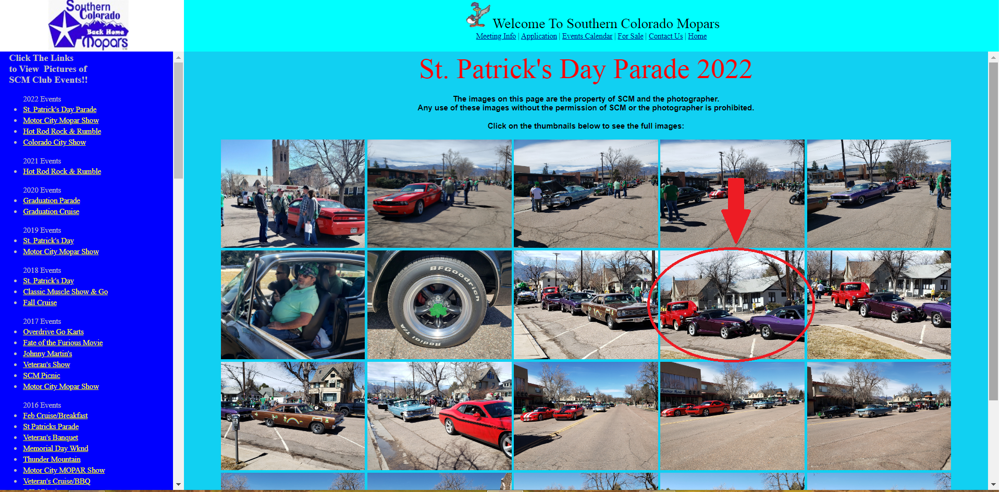
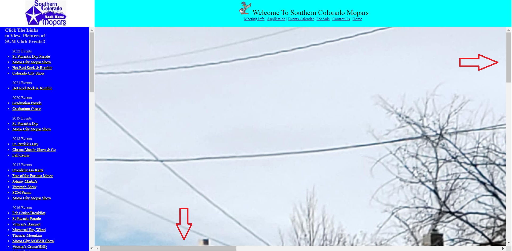
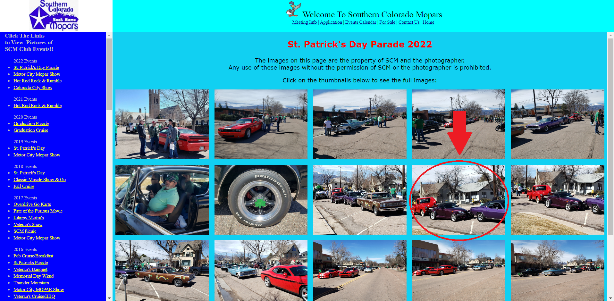
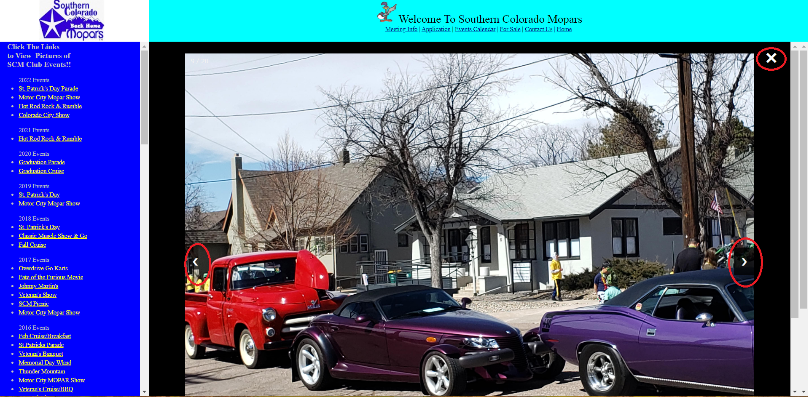

<h1>Photo Carousel Overlay</h1>

Previously, when a user clicked on any given photo, it would enlarge the photo to the point where vertical and horizontal scrollbars would have to be utilized in order to see the entire picture. Then, when the user was done, they would either have to hit the back button or re-click the event link to see the same set of photos.

Now when a user clicks on any given photo, it triggers the carousel overlay to pop-up, allowing the user to scroll through all of the event photos at once. When the user is done, they click the "x" to close the pop-up.
 

This creates a better, more efficient and enjoyable user experience, encouraging the user to continue to view photos.

